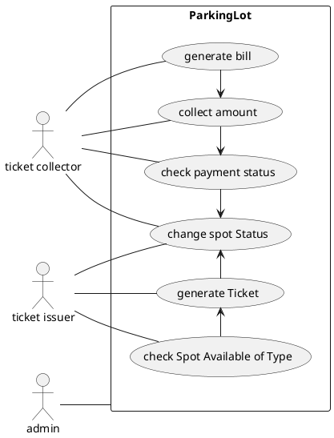
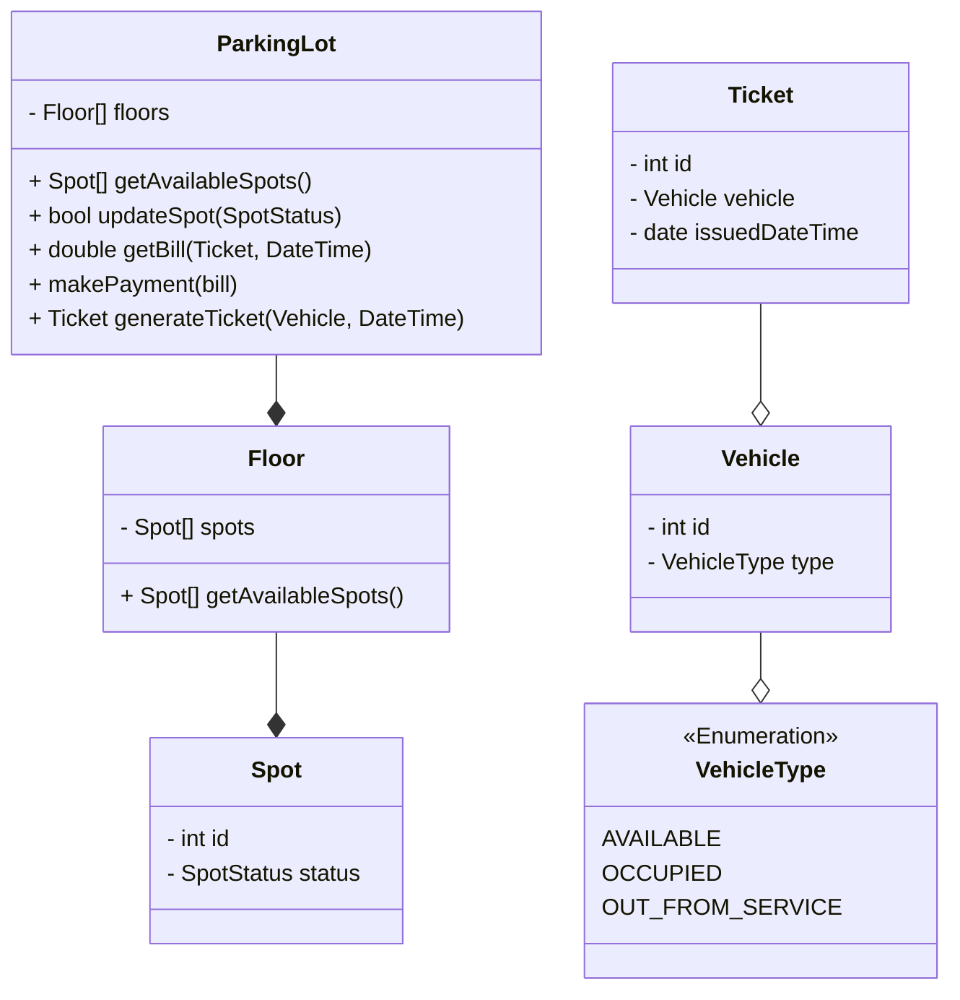

# PARKING LOT




### API

```
   GET /parkinglot/spots
   GET /parkinglot/spots?status=AVLBL
   GET /parkinglot/spots?floor=1&status=AVLBL

   POST /parkinglot/spot/:id

   GET  /parkinglot/payment/:id
   POST /parkinglot/payment
```


